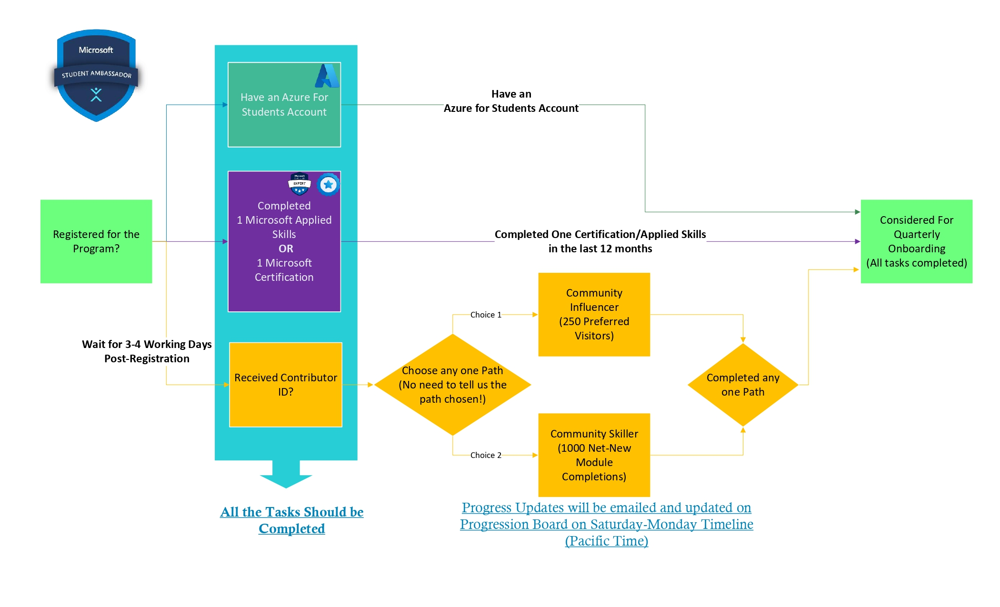

# 등록 가이드

## 등록 프로세스 (Step 1~5)

* **Step 1 등록:** Student Ambassadors 포털에서 등록하세요. 만 18세 이상이어야 하며 공인 학교에 정규 재학 중이어야 합니다.
* **Step 2 Contributor ID 수령:** 등록 후 3~5 영업일 이내에 이메일로 Contributor ID를 받게 됩니다. 이 ID를 통해 등록 회원 핸드북에 접근할 수 있습니다.
* **Step 3 경로 선택:** Contributor ID를 받은 후 경로를 선택하세요: Community Influencer | Community Builder
* **Step 4 자격증 취득:** 온보딩 12개월 이전에 Microsoft Certification을 취득하거나 Microsoft Applied Skills Assessment를 1개 이상 완료하세요.
* **Step 5 리포팅 및 진행 상황 업데이트:**
  * Community Influencer | 매주 토요일, 태평양 표준시
  * Community Skiller | 매주 토요일, 태평양 표준시
  * 리포팅 이메일은 매주 발송되며 처리 완료까지 최대 48시간이 소요될 수 있습니다. 리포팅 시간 48시간 이내에 완료된 활동은 즉시 반영되지 않을 수 있습니다.
* **도움이 필요하신가요?:** Discord 관련 또는 등록 문제의 경우: `discord@studentambassadors.com`으로 문의하세요.
  > **참고:** Discord 운영팀은 태평양 표준시(PST) 기준으로 운영되며 1~2 영업일 내에 답변합니다. 동일한 문제로 중복 이메일 발송을 삼가 주세요.

---

## 전체 흐름도

> **참고:** 진행 상황 업데이트는 매주 토요일~월요일(태평양 표준시) 기준으로 이메일 발송 및 Progression Board에 업데이트됩니다.

---

## 프로그램 등록 후 무엇을 해야 하나요?
학생들은 StudentAmbasssadors.com을 방문하여 [지금 시작하기]를 클릭해 커뮤니티에 등록합니다. 등록은 빠르고 간단하며 5분 이내에 완료할 수 있습니다. 등록 후에는 관심사와 역량에 맞는 사전 정의된 활동을 완료하여 Student Ambassador가 됩니다. 이러한 활동에는 AI 기반 솔루션 구축, 커뮤니티 행사 주최, 소셜 미디어 콘텐츠 공유 등이 포함될 수 있습니다. 관심사와 역량에 맞는 등록 경로(Community Influencer 또는 Community Skiller)를 선택하고, 해당 경로의 사전 정의된 활동을 완료하여 Student Ambassador가 되세요. 활동 요건을 충족한 등록 회원은 Student Ambassadors 프로그램 초대를 받게 됩니다. 초대를 수락하면 프로그램에 온보딩되어 공식 타이틀, 인증서 및 Student Ambassadors 회원 혜택(@studentambassadors.com 이메일, Microsoft Teams 접근 포함)을 받게 됩니다.

---

## Student Ambassadors 등록 경로란?
등록 경로(Community Influencer 또는 Community Skiller)는 2가지 넓은 관심사 및 역량 카테고리에 맞춰 학생들이 Student Ambassador가 되는 과정에서 중요한 것에 집중할 수 있도록 합니다. 등록 경로를 선택하고 해당 경로의 사전 정의된 활동을 완료하여 Student Ambassador가 되세요.

| COMMUNITY INFLUENCER 경로 | COMMUNITY SKILLER 경로 |
|---|---|
| Community Influencer는 Microsoft 콘텐츠를 제작하고 공유하여 청중을 유치하고 인게이지먼트를 높임으로써 온라인 영향력을 키우고 싶어합니다. | Community Skiller는 Microsoft 교육 콘텐츠가 포함된 Student Learn Plans를 개최하여 리더십 역량을 키우고 싶어합니다. |
| Community Influencer에 대해 더 알아보기 → | Community Skiller에 대해 더 알아보기 → |

---

## Ambassador가 되는 데 얼마나 걸리나요?
바쁜 일상과 많은 책임이 있다는 것을 잘 알고 있습니다. 그래서 본인의 일정에 맞게 등록 활동을 완료할 수 있도록 지원합니다. Student Ambassador가 되는 속도는 여러분이 결정합니다. 온보딩된 Student Ambassadors는 활동 완료 시기에 대한 안내를 받지만, 일정은 학생 스케줄을 고려하여 설계됩니다. 본인의 캘린더를 자유롭게 관리할 수 있습니다.

---

## Student Ambassadors 프로그램 등록을 취소하려면 어떻게 하나요?
Ambassador가 되는 것에 더 이상 관심이 없다면 아래 단계를 따라 등록을 취소하세요. 등록 취소는 Student Ambassadors 소셜 미디어 회원 자격에는 영향을 미치지 않습니다.
* Student Ambassadors 사이트에 접속하여 등록 계정으로 로그인
* 우측 상단의 프로필 원형 아이콘을 선택한 후 내 계정 선택
* 왼쪽 메뉴에서 개인정보를 선택하고 빨간 박스의 데이터 삭제 클릭
* 표시된 대로 이름을 입력하고 내 데이터 삭제 클릭
